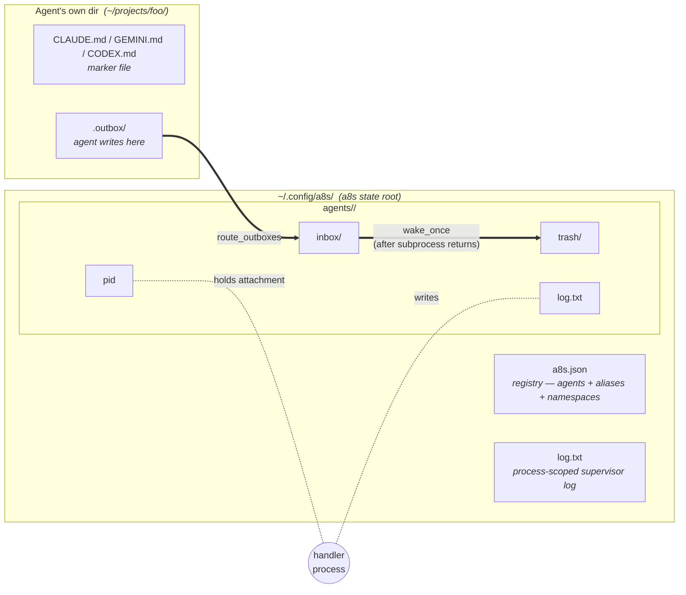

# a8s — Agent Infinity System

A lightweight way to wire multiple agents — Claude Code sessions, Gemini CLI projects, codex sessions, plain scripts, eventually humans — into a roster that can talk to each other.

> **Status: pre-v1.** Surface and storage layout will keep changing without migration paths until the design settles.

## Why

Modern agent tooling like Claude Code's subagents is great inside one process and one tool's permission model. But:

- **Process and machine boundaries matter.** One agent might need codex's workspace-write sandbox; another might need Claude with a narrow allowlist; another might need to run on a different machine entirely. Cramming them into a single host process is the wrong abstraction.
- **Members shouldn't have to know about a8s.** Drop in any existing project unchanged. The agent just sees a `tell` command and wakes to messages — same shape whether it's a Claude session, a Python program, or (someday) an SMS gateway routing to a human.
- **Recipient opacity is the load-bearing invariant.** The sender doesn't know whether the recipient is a Claude session, a script, or a person on the other end of an email-to-message bridge. That's how this scales — anywhere the abstraction fits, you plug in.
- **Eventually, one fabric across machines.** Tracked in #63: two a8s clusters on the same network see each other and route messages as peers. The local design today is shaped to accommodate that without breaking.

The win at scale: a roster of agents that share knowledge through ordinary conversation grows faster than a collection of silos, and you interact with all of them through one verb (`tell`).

## Desktop filedrop

Humans and desktop IDE sessions (Cursor, Claude Code, Codex) can run a
**filedrop** node: `a8s start` keeps delivering into `.inbox`, and you watch
with `tells -f` (inbound only). Deployed agents do not use this path — a8s
sets `TELL_OUTBOX_DIR` on wake, so `tell` works from their own root.

→ **[Filedrop setup](a8s-filedrop.md)** (`a8s add … filedrop`, handler)
→ **[Agent playbook](https://github.com/witw-llc/ar3-private/wiki/Playbook-a8s-Filedrop-Agent)** (IDE seats: send/receive norms)

## Mental model




Three concepts:

- **Registry** (`a8s.json` under the a8s state root) — the list of agents, aliases, and namespace prefixes. Agents have a name, a directory, and a *definition* (a JSON file describing how to wake them). Optional `safe_dirs` remains in the schema but is unused for attachment routing: tell stages files into `<root>/.files/` and envelopes reference filename only.
- **Handlers** — a process that holds the attachment for one or more agents. Pid file at `agents/<NAME>/pid` under the a8s state root. One agent is handled by exactly one process at a time, but one process can handle many agents (typically by attaching to an alias).
- **Mailboxes** — agents write to `<agent-root>/.outbox/`; routing copies into `agents/<RECIPIENT>/inbox/` under the a8s state root for CLI agents (wake from there). **Filedrop** nodes (`definitions/filedrop.json`) instead receive into `<root>/.inbox/` with no CLI wake — see [docs/a8s-filedrop.md](a8s-filedrop.md).

The router doesn't trust the sender. The `from` field is force-overwritten to the actual enclosing agent at routing time. An agent can't impersonate another by hand-writing JSON.

## Quickstart

```bash
# Find candidate agents.
a8s discover ~/projects

# Register them. Auto-detects the right definition from the marker file
# (CLAUDE.md / GEMINI.md / CODEX.md).
a8s add CLAUDE ~/projects/code-review
a8s add GEMINI ~/projects/research

# Optional: group them.
a8s alias devs CLAUDE
a8s alias devs GEMINI

# Background daemon handling both members of the alias in one process.
a8s start devs

# See every registered node (running or not).
a8s ls
#   NAME     STATUS                DEFINITION  ROOT
#   CLAUDE   running (pid 12345)   claude      /Users/me/projects/code-review
#   GEMINI   running (pid 12345)   agy         /Users/me/projects/research

# See just the running node processes.
a8s ps
#   NAME     PID     UPTIME   ROOT
#   CLAUDE   12345   2h       /Users/me/projects/code-review
#   GEMINI   12345   2h       /Users/me/projects/research

# Send messages. Woken agents get `TELL_OUTBOX_DIR` from a8s. Manual / desktop
# tell uses that env var, or a unique CWD-matched configured outbox
# (see docs/a8s-filedrop.md / docs/a8s-tell.md).
# Body on stdin with a quoted delimiter: $, backticks, and backslashes survive.
cd ~/projects/code-review
tell GEMINI - <<'EOF'
look at lines 40-80 of foo.py
EOF
tell devs "stand-up at 3pm"   # trailing argument: short plain bodies only

# Read what each agent is doing.
a8s logs CLAUDE GEMINI --tail 20

# Stop the daemon (graceful — finishes the current wake first).
a8s stop devs
```

That's the full loop. Members don't know they're "in a8s" — they just see a `tell` command available in their shell and wake to messages the same way they wake to any prompt.

## Commands

### Registration


|                                |                                                                                                                                                                |
| ------------------------------ | -------------------------------------------------------------------------------------------------------------------------------------------------------------- |
| `a8s add <name> <dir> [<def>] [--KEY=value …]` | Register an agent. Auto-detects definition from `<dir>`'s marker file unless `<def>` is given (path, or bare name from bundled `definitions/` or `a8s defs add`). Trailing `--KEY=value` sets per-node a8s vars (case-insensitive; same as `a8s vars`). |
| `a8s remove <name>` / `a8s rm <name>` | Unregister an agent. Wipes `agents/<NAME>/` under the a8s state root and prunes the agent from any alias's member list (deletes empty aliases). Refuses if a handler is running. |
| `a8s define <name> [<path>]`   | Show or set the agent's definition file (path or bare name).                                                                                              |
| `a8s definitions` / `a8s defs` | Manage user-installed templates in `definitions/` under the a8s state root (`add` / `rm` / `ls`). Basename must not collide with a repo built-in; bare names then work with `add`/`define`. |
| `a8s vars <name> [set\|unset …]` | Per-node a8s vars for `$KEY` in definition argv (not OS env). Used-but-unset fails wake. |
| `a8s discover <path>`          | Walk a path for marker files; print suggested `add`+`define` commands. Read-only.                                                                              |
| `a8s ls [-q]`                  | List every registered node, running or not: NAME, STATUS (`running (pid N)` / `stopped`), DEFINITION, ROOT, and bound namespaces. `-q` prints just names. |


### Aliases


|                                  |                                                                                      |
| -------------------------------- | ------------------------------------------------------------------------------------ |
| `a8s alias <alias> <member>`     | Create or extend an alias. Members can be agents or other aliases (cycles rejected). |
| `a8s unalias <alias> [<member>]` | Remove a single member, or the whole alias.                                          |
| `a8s aliases`                    | List every alias and its resolved members.                                           |


### Namespaces


|                                  |                                                              |
| -------------------------------- | ------------------------------------------------------------ |
| `a8s namespace <prefix> <agent>` | Bind an address prefix to one agent. Rebinding overwrites.   |
| `a8s unnamespace <prefix>`       | Remove a namespace binding.                                  |
| `a8s namespaces`                 | List every namespace prefix and its bound agent.             |


A namespace binds an address **prefix** to a single node agent. Recipients
`<prefix>:<sub-address>` and a bare `<prefix>` (no colon) both route to that
one agent — single delivery by design, the opposite of alias fan-out, which
is why the bind target must be an agent, not an alias. The address splits on
the FIRST colon and everything after it is opaque to a8s (`acme:ops:phil`
still routes on prefix `acme`); the sub-address must be non-empty when a colon
is present (`acme:` is malformed). A bare `<prefix>` is delivered with `to`
equal to the prefix; the node self-routes (r4t sends that to the roster
leader). The full recipient string is preserved in the delivered message's
`to`, so the node's `$RECIPIENT` carries it verbatim.

```bash
# One registered node agent owns every acme:*-style address.
# (The registration binds the prefix — wildcards are not address syntax.)
a8s add acme-node ~/projects/acme-hall
a8s namespace acme acme-node

tell acme "status?"               # delivered to acme-node with to = "acme"
tell acme:phil "lunch at noon?"      # delivered to acme-node with to = "acme:phil"
tell acme:ops:lee "deploy done"      # same node; sub-address opaque to a8s
```

By default a binding changes nothing about how the node presents: a sub-sender
claim under the node's own prefix stands to any recipient (`acme:phil` arrives
as `acme:phil`), since only the bound node writes that outbox and a claim under
its own prefix carries its own authority. Bind with `--opaque` to conceal
instead: mail leaving that prefix presents `from` as the bare prefix — `acme`,
not the `acme-node` registration name and not the sub-sender that wrote it —
so an opaque namespace is one address on the network whether it fronts one
agent, a human, or a whole roster, and a reply to that name routes back in
through the binding. Mail addressed *inside* the prefix keeps sub-sender
attribution either way. Ownership is always settled by the filesystem, not the
JSON: a claim the sender's own namespaces don't back is discarded. An opaque
node with several opaque prefixes has no unambiguous outward name, so its
agent name stands for anything but a claim under one of them. Rebinding
without the flag clears opacity; `a8s namespaces` marks opaque bindings.

Prefixes share the agent/alias name grammar (lowercase canonical form,
case-insensitive match). A prefix may match the name of the agent it binds to
— a node owning its own namespace, so `s1l` registers as agent `s1l` and binds
prefix `s1l` to itself. A prefix still can't collide with an alias or with
a *different* agent's name (a bare `tell <prefix>` resolves to the namespace,
which would otherwise silently shadow that agent). An unknown prefix behaves
like any unknown recipient: published to configured remotes (another cluster
may own the binding), or trashed when there are none. Removing an agent unbinds
any prefixes pointing at it.

### Handlers


|                    |                                                                                                                                                                                                                                                                                     |
| ------------------ | ----------------------------------------------------------------------------------------------------------------------------------------------------------------------------------------------------------------------------------------------------------------------------------- |
| `a8s start <name>` | Spawn a detached background process to handle the agent (or every member of an alias, in one process).                                                                                                                                                                              |
| `a8s run <name>`   | Foreground attached loop. Aliases produce one process with interleaved output. Ctrl+C: graceful detach. 2nd Ctrl+C: kill the wake subprocess group.                                                                                                                                 |
| `a8s step <name>`  | Attach, do one route+drain pass, release. Heavyweight: detaches the current handler if any.                                                                                                                                                                                         |
| `a8s stop <name> [--force]` | SIGTERM the handler, then **wait** until it has detached. Idle stops immediately; a busy wake finishes first (like first Ctrl+C). `--force` / `-f` sends a second SIGTERM to kill the in-flight wake (like second Ctrl+C), then waits. |
| `a8s restart <name> [--force]` | `stop` (wait until detached) then `start`. `--force` is passed to stop. If not running, just starts. |
| `a8s update [--force]` | Run conversation housekeeping, then restart every running node so handlers re-exec current on-disk a8s (handy after `git pull`). Alias co-handlers that match an alias are restarted as one process. No code fetch yet — that comes with standalone releases. |
| `a8s kill <name>`  | Per-agent force-detach: writes a kill-request, SIGUSR1s the holder. Holder kills the in-flight wake subprocess iff it's for that agent and releases the attachment; siblings keep running. Falls back to whole-process SIGTERM only if the holder doesn't honor the request in 10s. |
| `a8s exit`         | SIGTERM every running handler.                                                                                                                                                                                                                                                      |
| `a8s ps [-q]`      | List only running node processes: NAME, PID, UPTIME, ROOT. `-q` prints just names. Empty state hints at `a8s ls`.                                                                                                                                                                    |


### Messaging


|                                                                             |                                                                                                                                                                                                                                                                                                                           |
| --------------------------------------------------------------------------- | ------------------------------------------------------------------------------------------------------------------------------------------------------------------------------------------------------------------------------------------------------------------------------------------------------------------------- |
| `a8s tell <name> [<msg>\|-]`                                                | Routed message via `_write_outbox` into the sender's configured outbox. `-` reads the body from stdin (`- <<'EOF'` / `- < file.md`), which keeps shell expansion out of it. `<name>` may be an agent or alias (fans out at routing time). Sender = agent whose root encloses CWD; router force-stamps `from` from outbox ownership.                                                                                           |
| `tell <name> [<msg>\|-]` (top-level shim, `tell` at the repo root) | Delegates to `a8s tell` (`apps/a8s/tell.py`). Outbox: `TELL_OUTBOX_DIR` if set, else a unique configured outbox matched from CWD when the a8s state root is readable (see [filedrop.md](a8s-filedrop.md)). Drops a JSON envelope. When the registry is reachable, `from` stamping applies; recipient validation applies only when the resolved outbox is a registered one (a staging outbox belongs to another router — see [a8s-tell.md](a8s-tell.md#who-validates-the-recipient)). Windows: `tell.cmd`. Operator internals: [a8s-tell.md](a8s-tell.md). |
| `tells [-f] [--timeout SEC] [--body-max N] [--glow [theme]]` (shim `tells` at the repo root) | Receive-side complement of `tell` (`apps/a8s/tells.py`). Same outbox resolution as `tell`; watches `.inbox` beside it. Default: wait up to 5s for a burst. `-f` / `--timeout 0`: follow until Ctrl+C. Bodies over `--body-max` / `TELLS_BODY_MAX` (default 16000; `0` = unlimited) print a `python3 -c` recovery command for the inbox JSON. `--glow` / headings share convo's markdown formatting. Non-destructive. Prefer over `convo -f` for filedrop inbound-only loops. |
| `a8s logs <name>... [--tail N] [-f]`                                        | Read per-agent log files; one agent in append order, multiple merge by ISO timestamp. `-f` follows.                                                                                                                                                                                                                       |
| `a8s convo <name> [--limit N] [-f] [--glow [theme]]`                        | Markdown history of messages to or from an agent. Default `--limit 10`; this controls display only. `-f` follows sequence-numbered rows in `conversations.sqlite3` (shows outbound too — use `tells -f` for filedrop inbound-only). `a8s update` retains `convo_max_rows` rows (default 50000). |
| `a8s trace <ULID>`                                                          | Show locally observed transaction boundaries for one envelope: routing, remote publication/resolution, inbox write, delivery receipt, and agent wake. Rows come from `transactions.sqlite3`; `a8s update` retains `txlog_max_rows` (default 200000). |
| `a8s drain <name>`                                                          | Move pending inbox JSON to trash without waking the agent.                                                                                                                                                                                                                                                                |
| `a8s mcp serve`                                                             | Stdio MCP server (`apps/a8s/mcp_server.py`) registering server `a8s` with tool `tell` — the model sees `a8s_tell`. A harness spawns it as a child of the turn, so it inherits `TELL_OUTBOX_DIR`; the body arrives as a JSON argument and is delivered through `a8s tell <recipient> -`, so no shell touches it. Point a harness at it with the config idiom it accepts (r4t does this per turn behind `r4t rig set <rig> mcp on`). `A8S_MCP_LOG` appends one JSON line per tool call. |


### Configuration


| | |
|---|---|
| `a8s config` | List settings with effective values and source (`settings.json`, `env`, or default). |
| `a8s config get <key>` | Print one setting. |
| `a8s config set <key> <value>` | Persist to `settings.json` under the a8s state root. |
| `a8s config unset <key>` | Remove key from settings.json; fall back to env then default. |

Env vars apply only when a key is absent from `settings.json` (e.g. `A8S_CONVO_MAX_ROWS`, `A8S_LOOP_INTERVAL`). `a8s config` with no arguments lists every knob — machine-wide, per-agent definition, registry, network, env, and constants — even read-only ones.

Pre-v1 rename: `convo_max_limit` / `A8S_CONVO_MAX_LIMIT` were replaced by `convo_max_rows` / `A8S_CONVO_MAX_ROWS`. Existing values under the old names are ignored.


### Remotes (issue #63)


|                                                                |                                                                                                                                                                                                                                                                                                                                                                                                                                        |
| -------------------------------------------------------------- | -------------------------------------------------------------------------------------------------------------------------------------------------------------------------------------------------------------------------------------------------------------------------------------------------------------------------------------------------------------------------------------------------------------------------------------- |
| `a8s remote`                                                   | List configured remotes (transport, broker, topic, opts; passwords masked).                                                                                                                                                                                                                                                                                                                                                            |
| `a8s remote <name>`                                            | Show one remote's spec.                                                                                                                                                                                                                                                                                                                                                                                                                |
| `a8s remote <name> <broker-url> <topic> [--<opt> <value> ...]` | Register or overwrite a remote. Broker URL is `mqtt://host[:1883]` or `mqtts://host[:8883]`. Persistent session + QoS 1 are wired automatically so an offline cluster catches up on reconnect. Non-secret opts land in `network.json`; `--pass` / `--password` go to `secrets.json` (0600) in the same command — `--pass` is optional. Unknown options are rejected by the transport at load time so typos fail loud. |
| `a8s unremote <name>`                                          | Forget a remote. Running daemons keep using the prior config until restart.                                                                                                                                                                                                                                                                                                                                                            |


Remotes are git-shaped: an explicit list of places to fan messages out to. a8s only crosses cluster boundaries on `tell` / `prompt` — everything else (`a8s logs`, `a8s ls`, `a8s ps`) is strictly local. If you want cross-cluster log access, register an a8s connector that turns inbound tells into local `a8s logs` calls; a8s itself just enables the message + invocation path.

Configure as many remotes as you want and a8s publishes to all of them in parallel; receivers dedupe by ULID, so adding redundant brokers improves delivery without producing duplicate inbox writes. A message to an unknown-locally recipient publishes to all configured remotes and is delivered by whichever cluster has the recipient registered locally. Per-message exponential backoff (30s → 1m → 2m → 5m → 15m → 30m → 1h → 6h → 24h) retries unreachable remotes; after the schedule is exhausted the message is moved to the sender's trash with a "discarded after backoff" log.

File payloads (`FILE:`) are local-only in v1 — the sender's path doesn't exist on the receiving cluster. Cross-cluster file transfer rides issue #62.

`a8s` with no command prints help. There is no auto-discovery of agents from CWD — registration is always explicit.

### Per-agent take-over

`start`/`run`/`step` against an agent that's already attached to another live process performs a **per-agent** hand-off. The new caller drops a `detach-request` file under `agents/<NAME>/` in the a8s state root; the existing handler reads it at the top of its next iteration and releases just that one agent — its other handled agents keep running. Then the new caller atomically claims the pid file. There is never an orphan: at every moment, an agent is either attached to exactly one live process or it isn't running at all.

Concretely: P1 is `a8s start devs` (handling `[CLAUDE, GEMINI, FOO]`). You run `a8s run CLAUDE` in another window. CLAUDE moves to your foreground process; P1 keeps handling `[GEMINI, FOO]`. If you then `a8s run GEMINI` in a third window, GEMINI moves there; P1 keeps `[FOO]`. If P1's last agent gets pulled out, P1 exits cleanly with nothing left to handle.

`a8s kill <name>` works the same way but force: it writes a `kill-request` file and SIGUSR1s the holder, which kills the in-flight wake subprocess (if any) for just that agent and releases the attachment. P1 keeps its other agents either way.

Take-over has a 60-second timeout (kill is 10s). If the holder is wedged on a long LLM wake and doesn't honor the request in time, the requester errors out (or, for `kill`, escalates to a whole-process SIGTERM as a last resort).

## Definitions

Each agent has a definition file: a JSON document describing how to invoke its CLI for each verb. Built-in defaults ship in `apps/a8s/definitions/`:


| File            | Purpose                                                                                                                                                                                                                                            |
| --------------- | -------------------------------------------------------------------------------------------------------------------------------------------------------------------------------------------------------------------------------------------------- |
| `claude.json`   | Claude Code with `--permission-mode dontAsk` allowlist + `--continue`                                                                                                                                                                              |
| `agy.json`      | Antigravity (agy) with `--dangerously-skip-permissions` + `--continue` for headless operation (no `--sandbox`: it confines child writes to CWD, blocking `tell`'s staging outbox)                                                                  |
| `codex.json`    | Codex CLI with `--full-auto` workspace-write sandbox + `resume --last`                                                                                                                                                                             |
| `copilot.json`  | GitHub Copilot CLI with `--allow-all-tools` (required for non-interactive `-p` mode) + `--continue`. Marker is `.github/copilot-instructions.md` (Copilot's native repo-instructions location).                                                    |
| `cursor.json`   | Cursor Agent CLI (`agent`) with `-p --trust --force --approve-mcps --continue` for headless tool use. Marker is `CURSOR.md`.                                                                                                                       |
| `opencode.json` | [OpenCode](https://opencode.ai/) — BYO model. `opencode run --continue --dangerously-skip-permissions`. Operator picks the provider/model in each agent's own `opencode.json` (e.g. `{"model": "ollama/gpt-oss:20b"}`), not in the a8s definition. |
| `ollama-opencode.json` | OpenCode via `ollama launch` — requires a8s var `MODEL`. Example: `a8s add bob ./ ollama-opencode --model=qwen3.6`. |
| `filedrop.json` | Filedrop seat — file-proxy delivery into `<root>/.inbox/`; no CLI wake. Watch with `tells -f`. See [docs/a8s-filedrop.md](a8s-filedrop.md). Bare name: `a8s add <name> <dir> filedrop`.                                                              |
| `claude-proxy.json` | Claude Code filedrop variant (same file-proxy shape).                                                                                                                                                                                           |
| `r4t.json`      | [r4t](r4t.md) roster node — dispatch + idle wakes into `r4t.py`. Bare name: `a8s add <name> <dir> r4t`.                                                                                                                                   |
| `echo.json`     | Echo node — replies to the sender with the same message; attachments acknowledged by name. A reachability probe: one tell proves the whole path out and back. Bare name: `a8s add <name> <dir> echo`.                                               |
| `default.json`  | Fallback — runs `dummy-cli` and prints "no real CLI configured"                                                                                                                                                                                    |


### Marker files & auto-discovery

`a8s discover <path>` and `a8s add <name> <dir>` (without an explicit definition) figure out which CLI an agent uses by scanning for one of these marker files at the agent's root, in order:


| Marker                            | Definition | Where the CLI itself looks                                                                                                                                                                         |
| --------------------------------- | ---------- | -------------------------------------------------------------------------------------------------------------------------------------------------------------------------------------------------- |
| `CLAUDE.md`                       | claude     | [Claude Code memory](https://docs.claude.com/en/docs/claude-code/memory)                                                                                                                           |
| `GEMINI.md`                       | agy        | [Antigravity (agy) context files](https://github.com/google-gemini/gemini-cli/blob/main/docs/cli/configuration.md)                                                                                 |
| `CODEX.md`                        | codex      | [Codex CLI configuration](https://github.com/openai/codex)                                                                                                                                         |
| `.github/copilot-instructions.md` | copilot    | [Copilot CLI repository custom instructions](https://docs.github.com/en/copilot/how-tos/configure-custom-instructions/add-repository-instructions) — the same file Copilot itself auto-loads       |
| `CURSOR.md`                       | cursor     | a8s marker for [Cursor Agent CLI](https://cursor.com/docs/cli/using) agents. Cursor also loads `AGENTS.md` and `.cursor/rules/`; use `CURSOR.md` when this directory is a Cursor CLI agent in a8s. |
| `AGENTS.md` (fallback)            | opencode   | [The agents.md standard](https://agents.md/) — tool-agnostic instructions stewarded by the [Agentic AI Foundation](https://agentic.foundation/) under the Linux Foundation                         |


The first five are **definition-specific** marker locations — for the tools that have a distinct native instruction file, a8s uses that location directly. For Copilot we use its repo-instructions location (`.github/copilot-instructions.md`) rather than inventing a `COPILOT.md` — same file serves both a8s discovery and Copilot's own persona loading.

[AGENTS.md](https://agents.md/) is **tool-agnostic** and shared by 20+ tools (OpenAI Codex, Google Gemini CLI, GitHub Copilot, Cursor, Aider, Zed, Warp, JetBrains Junie, OpenCode, …). Because it can't disambiguate which CLI to invoke, a8s only resolves it as a marker when **no definition-specific marker is present** — and it falls through to **OpenCode**, which is BYO-model (the operator picks the provider in each agent's own `opencode.json`). A directory with `CLAUDE.md` + `AGENTS.md` resolves to `claude`; a directory with `CURSOR.md` + `AGENTS.md` resolves to `cursor`; a directory with only `AGENTS.md` resolves to `opencode`.

### The single verb

Every wake reads `definition["invoke"]` — one argv per definition. There is no verb dispatch and no special-case branches: `prompt` and `clear` are gone. Every message is a `tell` with a force-stamped agent `from`, so the same argv shape covers every wake.

Strict opacity (issues #69, #70) still holds: a routed message looks identical whether it arrived directly or via alias fan-out — `$RECIPIENT` resolves to whatever the sender wrote in `to` (the alias name for fanned messages, the agent name for direct ones). Mailing-list semantics.

### Schema

```json
{
  "description": "...",
  "invoke": ["claude", "...", "--continue", "-p", "$SENDER tells $RECIPIENT ($AGE): $MESSAGE"],
  "idle":   { "timeout": 1800, "invoke": ["claude", "-p", "summarize the day's tells"] }
}
```

Argv elements run through built-in substitutions plus any per-node **a8s vars**:

- `$SENDER` → sender's canonical name (always non-empty — every message has a force-stamped agent `from`).
- `$RECIPIENT` → what the sender wrote in `to` (alias name for fanned messages, agent name for direct ones).
- `$MESSAGE` → the message body (`content`, with any `ATTACHED FILE: <path>` lines appended for inbound attachments).
- `$TIMESTAMP` → ISO 8601 UTC timestamp the message was queued (e.g. `2026-04-28T14:30:00.123456Z`). Useful when you want a stable machine-readable time.
- `$AGE` → human-readable age relative to now (e.g. `5 minutes ago`). Computed at wake time, so a long backlog gets accurate values per message. Pick this OR `$TIMESTAMP` per definition based on which the LLM will read more naturally.
- `$META` → the envelope's `meta` object as compact JSON (`{"class":"auto"}`), empty when the message carries none. Protocol metadata one node stamps for another; a8s carries and hands it over without reading a key, so the vocabulary belongs to the nodes at the edges (r4t's message class is the first user).
- `$A8S_DIR` → `apps/a8s/` itself, so definitions can point at bundled scripts (`default.json` uses this for `dummy-cli`).
- `$DEFINITION_PATH` → resolved path of this agent's definition file.
- `$KEY` → any key from `a8s vars <name> set KEY value` (registry `vars` map). **Not** OS environment — no correlation with process env. If the definition references `$KEY` and that var is unset, wake fails closed.

`$TIMESTAMP` and `$AGE` are empty for any message without a `date` field (defensive — every `_write_outbox` stamps one). `$META` is empty unless the sending node stamped a `meta` object.

```bash
a8s add bob ./ ollama-opencode --model=qwen3.6
a8s vars bob set MODEL qwen3.6   # same effect after the fact; keys case-insensitive
a8s vars bob
a8s vars bob unset model
```

A shared definition can then use `"--model", "$MODEL"`; each node supplies its own value.

Override per-agent with `a8s define <name> <definition>` — a filesystem path or a bare name (`filedrop`, `claude`, or a user template from `a8s defs add`). The file isn't moved or copied into the agent root; the registry stores the resolved path.

Install reusable custom templates with `a8s defs add /path/to/mine.json` (copies into `definitions/mine.json` under the a8s state root). Basename must not collide with a repo built-in. `a8s defs ls` lists both; `a8s defs rm <name>` removes user installs only.

### max_wake_seconds (optional)

Top-level numeric field. When set, the attached handler kills the wake subprocess (whole process group) if it runs longer than N seconds. Useful for CLIs that hang instead of exiting (OpenCode, AGY, etc.). Omitted or non-positive = no limit.

While a wake subprocess is running, the handler keeps looping: it still routes every handled agent's outbox each iteration and can deliver tells that arrive mid-wake. Only one wake subprocess runs at a time per handler process; the next inbox message or idle invoke waits until the current wake finishes or is killed.

### Idle invoke (optional)

A definition's `idle` block fires `idle.invoke` when the agent has gone `idle.timeout` seconds without any wake activity. Update mechanics:

- `agents/<NAME>/last-active` under the a8s state root (ISO timestamp) is touched at every wake start, every wake end, and at the end of every idle invoke.
- After draining the inbox each iteration, `attached_loop` checks each handled agent: if `now - last_active >= timeout`, run `idle.invoke` via the same wake subprocess machinery that real wakes use.
- A wake subprocess in flight blocks starting another wake or idle invoke for that handler process; outbox routing still runs each iteration.
- `timeout: 0` (or negative / non-numeric) disables idle.
- Argv expansion: `$SENDER`/`$MESSAGE`/`$TIMESTAMP`/`$AGE` are empty (no incoming message); `$RECIPIENT` is the agent's own name; `$A8S_DIR` resolves as usual.

This subsumes the retired `clear` use-case: define an idle invoke that runs whatever your CLI needs to reset session state (e.g. `claude -p "/clear"`).

### Batch invoke (optional)

Agents that can process multiple tells in one subprocess can declare a `batch` block. When **two or more** inbox messages are waiting, a8s wakes once with `batch.invoke` plus the message JSON file paths as trailing argv elements (shell-style — no extra placeholder).

```json
{
  "pause": 3,
  "invoke": ["my-agent", "--single", "$SENDER", "$MESSAGE"],
  "batch": {
    "invoke": ["my-agent", "--batch"],
    "limit": 5
  }
}
```

- `pause` — seconds to wait after the first inbox message of a burst before waking. Closely-spaced tells accumulate across handler iterations so `batch` is more likely to fire. `0` or omitted = wake as soon as the loop drains (previous behavior).
- `batch.invoke` — argv template with the same substitutions as `invoke` / `idle.invoke`.
- `batch.limit` — max messages per batch wake; defaults to **5**.
- One waiting message still uses normal `invoke` (unchanged).
- Paths point at the trashed inbox JSON files (under `agents/<NAME>/trash/` in the a8s state root), appended after the expanded `batch.invoke` argv.
- Batch argv expansion matches idle: `$RECIPIENT` is the agent's own name; `$SENDER` / `$MESSAGE` / `$TIMESTAMP` / `$AGE` are empty.

Debounce mechanics: on the first inbox message, a8s stamps `agents/<NAME>/inbox-waiting-since` under the a8s state root and skips waking until `pause` seconds elapse. Each loop iteration re-routes outboxes, so messages that arrive during the wait window join the inbox before the wake decision. The stamp clears when the inbox drains or a wake fires.

### Delivery ack and retry

**Exit 0 is the only ack.** A wake that exits nonzero, gets killed for exceeding `max_wake_seconds`, fails to spawn, or aborts on an unset var puts its envelopes back in the agent's inbox and waits before trying again — 30s, then 2m, then 10m. After the 4th failed attempt the envelopes stay in trash as dead letters, logged in the agent log and recorded as `DROPPED` in `transactions.tsv`, so one poison message can't wedge the inbox shut. The backoff is per agent (`agents/<NAME>/wake-retry` under the a8s state root) and survives handler restarts, so a broken CLI backs off instead of burning a wake per loop iteration.

Delivery is therefore at-least-once: **a wake command must tolerate seeing the same envelope twice.** The cheap way to guarantee that is to ack early — record the message durably, exit 0, and do the slow work afterwards. Reserve nonzero exits for "I did not receive this."

### Recipient transparency

The default definitions follow the opacity rule — `$SENDER tells $RECIPIENT: $MESSAGE` works equally well whether `$RECIPIENT` is an LLM session, a Python script, or (someday) an SMS gateway. Customize at your own risk.

## State on disk

When `A8S_HOME` is set it is the a8s state root, whatever else exists on disk. Unset, the root is `~/.config/a8s` if that directory exists, `~/.a8s` if that one does (legacy), and otherwise `~/.config/a8s`, created fresh — everything below is relative to that root.

```
~/.config/a8s/                (or wherever A8S_HOME points)
├── a8s.json                  registry: { agents: {...}, aliases: {...}, namespaces: {...} }
├── settings.json             operator settings (`a8s config`; env fills gaps)
├── network.json              remotes / services (non-secret)
├── secrets.json              remote secrets (`pass` / `password`; mode 0600)
├── seen-ids                  cluster-wide ULID ring for receive-side dedup
├── conversations.sqlite3     routed message archive (`a8s update` retains convo_max_rows)
├── transactions.sqlite3      routing breadcrumbs for `a8s trace` (retains txlog_max_rows)
├── log.txt                   process-scoped supervisor log
└── agents/
    └── <NAME>/
        ├── inbox/            pending JSON messages (drained by wake_once)
        ├── inbox.tmp/        maildir-style atomic stage for fan-out
        ├── pending/          messages a8s has ingested from .outbox/
        │                     awaiting full delivery — `<ulid>.json` plus
        │                     optional `<ulid>.json.retry` sidecar tracking
        │                     attempts + per-remote success
        ├── trash/             processed messages
        ├── log.txt            per-agent log (wakes, routing, subprocess output)
        ├── last-active        ISO timestamp; touched at wake start/end and
        │                     after every idle invoke (gates `idle.invoke`)
        ├── wake-retry         backoff record after a failed wake: which
        │                     envelopes, how many attempts, when to retry
        └── pid                handler attachment

<agent-root>/
└── .outbox/                  agent writes here; a8s renames out — never
                              read-modify-writes — to ~/.config/a8s/agents/<NAME>/pending/
```

The outbox lives in the agent's own dir because some sandboxes (codex `--full-auto`) only let the agent write inside its workspace. Inbox/trash/pending live under the a8s state root where the agent can't see them — and per the agent-directory invariant, a8s never sidecars or rewrites in `.outbox/`. New outbox files are atomically renamed to `pending/` on every routing pass; everything from there (sidecars, retries, trash, remote publishes) happens in the a8s state root.

`from` is force-overwritten at routing time. An agent that hand-writes a JSON with `from: "VICTIM"` doesn't get to spoof — the file's outbox location is the unforgeable identity. A namespace binding can change what the identity *presents as* (`--opaque`), never whose it is: see [Namespaces](#namespaces).

## Connectors

A connector is just an a8s agent whose `definition.invoke` runs a script instead of an LLM CLI. The first reference connector is the Gmail connector at `apps/a8s/connectors/gmail/`, which lets a human read and respond to a8s messages over email.

Strict recipient opacity holds: other participants `tell <name> ...` with no awareness that the recipient is Gmail-backed, a script, a human, or another LLM agent. The connector is the only thing that knows about its bridge format. See `apps/a8s/connectors/gmail/README.md` for setup.

## File proxy

A file-proxy agent communicates through filesystem sync instead of a CLI invocation. Designed for agents whose root is on a remote mount (rclone, NFS, Google Drive FUSE, etc.) where the "other side" polls for files independently.

### Setup

```bash
# Create a file-proxy definition (or use the bundled bare name `filedrop`)
cat > my-filedrop.json << 'EOF'
{"proxy": "file", "idle": {"timeout": 30}, "files_ttl_hours": 48}
EOF

# Optional: custom dirs (absolute paths OK)
# {"proxy": "file", "inbox_dir": "/mnt/sync/in", "outbox_dir": "mail/out", "files_dir": ".files", ...}

# Register with a mounted root directory
a8s add my-email /mnt/gdrive/my-email/ my-filedrop.json
# Or: a8s add neil-macbook ~/filedrops/neil-macbook filedrop
```

### How it works

- **On message:** a8s moves inbox JSON files into the definition's `inbox_dir` (default `<root>/.inbox/`) instead of invoking a subprocess. The remote side polls that directory, processes, deletes.
- **Outbox:** The remote side writes response envelopes to the definition's `outbox_dir` (default `<root>/.outbox/`). a8s ingests these on its normal routing pass (no change from regular agents).
- **Files:** Tell copies attachments into `.outbox/<msg_id>/` before writing the envelope (filename only in JSON). Ingest moves the bundle with the JSON; routing delivers into `<files_dir>/<msg_id>/` on each recipient (default `files_dir` is `.files` under the agent root; absolute paths OK). Wake prompts use absolute `ATTACHED FILE: <path>` lines. a8s creates `files_dir` when waking CLI agents and cleans up files older than `files_ttl_hours` (default 48) on each idle cycle.
- **Idle:** The `idle.timeout` controls how often a8s syncs (moves inbox files + runs TTL cleanup). No CLI is invoked.

### Filesystem layout (agent root)

```
/mnt/gdrive/my-email/
├── .inbox/     ← a8s writes here; remote side reads + deletes
├── .outbox/    ← remote side writes here; a8s ingests as normal
└── .files/     ← bidirectional attachments; TTL cleanup by a8s
```

### Use cases

- Local human / desktop IDE filedrops (`tells -f` — see [filedrop.md](a8s-filedrop.md))
- Google Apps Script participants (GAS polls Drive natively)
- Cross-machine agents without exposed ports
- Any system that can read/write files but can't run MQTT or hold sockets

## Source layout

```
apps/a8s/
├── a8s.py            entry shim (~30 lines)
├── core.py           paths, logging, Participant, helpers, MARKER_FILES
├── registry.py       a8s.json I/O + alias/namespace resolution + sender_from_cwd
├── mailbox.py        ensure_mailboxes, route_outboxes (ingest+process), queue helpers
├── definitions.py    invoke* verbs, prompt formatting, definition loading
├── daemon.py         wake subprocess, pid attachment, signal handling
├── ulid.py           pure-stdlib ULID generator/parser (message IDs)
├── network.py        network.json + publish_with_backoff + receive loop
├── transports/       Transport ABC + per-kind implementations
│   ├── __init__.py   abstract publish/subscribe/start/stop interface
│   └── mqtt.py       MQTT transport (paho-mqtt impl; persistent session, QoS 1)
├── tell.py           outbox drop + CLI (stdin, --attach)
├── tells.py          wait for the next inbound message (receive side)
├── commands.py       every cmd_*
├── cli.py            COMMANDS table, dispatch, main
├── definitions/      built-in JSONs (claude/cursor/codex/default)
├── dummy-cli         fallback bash script
├── skills/           tell skill markdown (agent-facing send-only usage)
└── tests/
    ├── agents/       per-tool fixture dirs (CLAUDE/GEMINI/CODEX/Llama)
    ├── fixtures/     mock-cli + mock.json for end-to-end tests
    ├── requirements.txt   test-only deps (paho-mqtt for transport tests)
    ├── conftest.py   pytest scaffolding (sys.path + fake_home fixture)
    └── test_*.py     ~230 tests, runs in <3s
```

## Testing

```bash
python3 -m pytest apps/a8s/tests/
```

Tests are isolated via a `fake_home` fixture that monkey-patches `HOME` to a tmp dir, so they never touch the real a8s state root. The daemon tests run real subprocesses against `tests/fixtures/mock-cli` (a deterministic bash script that echoes its argv) so wake_once's argv expansion and routing fan-out can be asserted on the per-agent log.

## Troubleshooting

### My agent created files locally but nothing arrived at the recipient

**Symptom:** The agent's own root has the files it produced (e.g. `fib.py`, `fib.txt`), but the recipient's `.files/` is empty and the recipient's inbox has no new message. The agent's log shows the model **emitted the `tell` command as plain text** in its final output instead of invoking it via its bash/shell tool — typical line: `opencode> tell <name> "..." FILE: ./...` with no `$` shell-tool prefix.

**Why it happens:** A tool-selection failure in the underlying model. The model conflates *"responding to the user"* (final assistant text) with *"running the tell shell command"*. Smaller and weaker local models hit this often; instruction-tuned frontier models almost never do.

**Fixes, in order of preference:**

1. **Strengthen the persona file.** Add a line to the agent's marker file (`AGENTS.md` / `CLAUDE.md` / etc.): *"`tell` is a shell command — invoke it via your bash/shell tool. Never print the command as text; that is not a reply, it is just narration."*
2. **Be explicit in the message.** When you suspect a model will fall back to text, append: *"Use your bash tool to actually execute the command — do not just print it as text."*
3. **Use a stronger model.** For OpenCode + Ollama, models with explicit tool-use training (e.g. Qwen3-Coder, GPT-OSS 20B+) compose tool calls more reliably than general-purpose chat models at the same parameter count.

### Ollama silently truncates context to 2k tokens

Ollama's default `num_ctx` is **2048**. Anything past that is dropped without warning, which means a long persona file plus message history can quietly lose your instructions. For agentic workflows, set `OLLAMA_CONTEXT_LENGTH=16384` (or more) in the environment Ollama runs under, or pull a model with a `Modelfile` that bumps `PARAMETER num_ctx`.

### `opencode models <provider>` says "Provider not found: ollama"

OpenCode's built-in providers don't include Ollama. Register it once in `~/.config/opencode/opencode.json`:

```json
{
  "$schema": "https://opencode.ai/config.json",
  "provider": {
    "ollama": {
      "npm": "@ai-sdk/openai-compatible",
      "name": "Ollama (local)",
      "options": { "baseURL": "http://localhost:11434/v1" },
      "models": { "gpt-oss:20b": { "name": "gpt-oss 20B" } }
    }
  }
}
```

Per-agent `opencode.json` then just picks the model: `{"model": "ollama/gpt-oss:20b"}`. The provider registration is shared infrastructure; the model selection is per-agent.

### A wake hangs forever with no output

The most common causes:

- **Codex without `stdin=DEVNULL`.** Codex CLI hangs reading stdin in headless mode. a8s already passes `stdin=subprocess.DEVNULL` for every wake (`daemon.run_with_prefix`), so this only bites if you're running the underlying CLI manually.
- **Headless permission denial.** Gemini without `--yolo`, Claude without `--permission-mode dontAsk`, Copilot without `--allow-all-tools`, OpenCode without `--dangerously-skip-permissions`, Cursor without `-p --force` — all silently deny tool calls in non-interactive mode and the wake stalls. The bundled `definitions/<name>.json` files include the required flag for each CLI definition; only worry if you write a custom definition.
- **Ollama model still loading.** A cold-start of a 20B model can take 10–30s before any output. `ps aux | grep ollama` should show a `runner` process consuming RAM proportional to the model size.

## Remote delivery receipts

Remote inbox writes produce a best-effort, content-free delivery receipt on
the same transport. This is an extension of the existing envelope shape:

```json
{
  "id": "<receipt ULID>",
  "date": "<ISO-8601 UTC>",
  "from": "_a8s",
  "to": "__a8s_receipt__",
  "content": "",
  "files": [],
  "a8s_control": {
    "type": "delivery_receipt",
    "version": 1,
    "for_id": "<original envelope ULID>",
    "sender": "alice",
    "recipients": ["bob"],
    "stage": "inbox_write"
  }
}
```

The reserved target is not a participant. A8s consumes supported control
envelopes before normal routing, so they never enter an agent inbox and never
generate receipts themselves. Subscribers without receipt support treat the
target as unknown and drop it. Only a cluster with the named original sender
records the receipt. Receipt publication is best-effort; absence of a receipt
does not prove non-delivery. Use `a8s trace <original ULID>` to distinguish the
last locally confirmed boundary.

## Roadmap

Pre-v1 — the surface still moves. Tracked threads:

- **#63 transport extensions** — MQTT (paho-mqtt impl) is the first transport (`a8s remote <name> <broker> <topic>`); follow-up PRs add a pure-stdlib mini-MQTT fallback that auto-activates when paho-mqtt isn't installed (same `mqtt` config kind), an HTTPS long-poll transport for self-hosted rendezvous, and a peer-to-peer TCP transport. App-level envelope encryption (per-network PSK, AES-GCM) lands as an implementation detail of specific remote types when wanted.
- **#62** — Cross-cluster file payloads. `FILE:` entries currently stay local-only across remotes; cross-cluster transfer needs a payload host (TempFile.org-style ephemeral storage with signed URLs and per-message symmetric keys) so the sender's bytes can move with the message envelope.

Beyond what's filed: human participants via SMS/email connectors; synchronous `tell --wait <id>` via message-id completion polling on `trash/`; web/local UI; shared knowledge stores between rosters.

## Pre-v1 / scorch-the-earth note

a8s has not reached v1. Surface, storage layout, and definition schemas change between phases without migration paths. Existing state under the a8s state root may need to be wiped and re-derived through `a8s discover` + `a8s add` after a breaking change. Once the design settles into v1, that contract changes.
